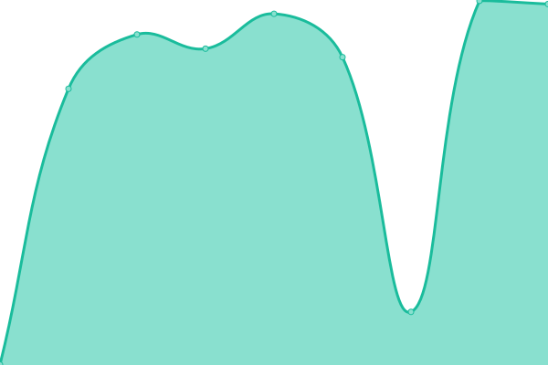
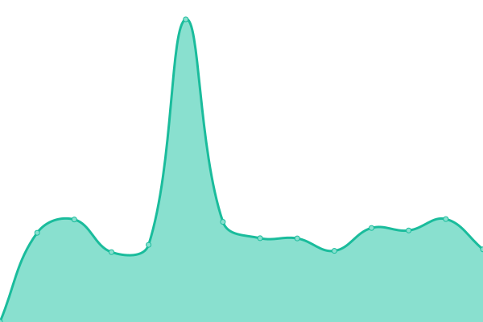
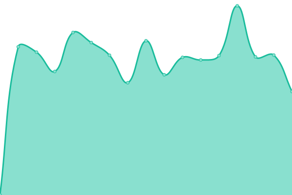

# [📈 Live Status](https://DarKWinGTM.github.io/Nodeclaw-Status): <!--live status--> **🟩 All systems operational**

This repository contains the open-source uptime monitor and status page for [Node Network](https://nodenetwork.ovh), powered by [Upptime](https://github.com/upptime/upptime).

With [Upptime](https://upptime.js.org), you can get your own unlimited and free uptime monitor and status page, powered entirely by a GitHub repository. We use [Issues](https://github.com/DarKWinGTM/Nodeclaw-Status/issues) as incident reports, [Actions](https://github.com/DarKWinGTM/Nodeclaw-Status/actions) as uptime monitors, and [Pages](https://DarKWinGTM.github.io/Nodeclaw-Status) for the status page.

<!--start: status pages-->
<!-- This summary is generated by Upptime (https://github.com/upptime/upptime) -->
<!-- Do not edit this manually, your changes will be overwritten -->
<!-- prettier-ignore -->
| URL | Status | History | Response Time | Uptime |
| --- | ------ | ------- | ------------- | ------ |
|  [NodeNetwork Website — nodenetwork.ovh](https://nodenetwork.ovh) | 🟩 Up | [node-network-website-nodenetwork-ovh.yml](https://github.com/DarKWinGTM/Nodeclaw-Status/commits/HEAD/history/node-network-website-nodenetwork-ovh.yml) | 

 841ms
     
 | 

<a href="https://DarKWinGTM.github.io/Nodeclaw-Status/history/node-network-website-nodenetwork-ovh">100.00%</a>
    

|  [NodeClaw App Health — app.nodenetwork.ovh/health](https://app.nodenetwork.ovh/health) | 🟩 Up | [node-claw-app-health-app-nodenetwork-ovh-health.yml](https://github.com/DarKWinGTM/Nodeclaw-Status/commits/HEAD/history/node-claw-app-health-app-nodenetwork-ovh-health.yml) | 

 1099ms
     
 | 

<a href="https://DarKWinGTM.github.io/Nodeclaw-Status/history/node-claw-app-health-app-nodenetwork-ovh-health">100.00%</a>
    

|  [NodeClaw Runtime Health — runtime.nodenetwork.ovh/health](https://runtime.nodenetwork.ovh/health) | 🟩 Up | [node-claw-runtime-health-runtime-nodenetwork-ovh-health.yml](https://github.com/DarKWinGTM/Nodeclaw-Status/commits/HEAD/history/node-claw-runtime-health-runtime-nodenetwork-ovh-health.yml) | 

 1366ms
     
 | 

<a href="https://DarKWinGTM.github.io/Nodeclaw-Status/history/node-claw-runtime-health-runtime-nodenetwork-ovh-health">100.00%</a>
    

<!--end: status pages-->

[**Visit our status website →**](https://DarKWinGTM.github.io/Nodeclaw-Status)

## 📄 License

- Powered by: [Upptime](https://github.com/upptime/upptime)
- Code: [MIT](./LICENSE) © [Anand Chowdhary](https://anandchowdhary.com), supported by [Pabio](https://pabio.com)
- Data in the `./history` directory: [Open Database License](https://opendatacommons.org/licenses/odbl/1-0/)
